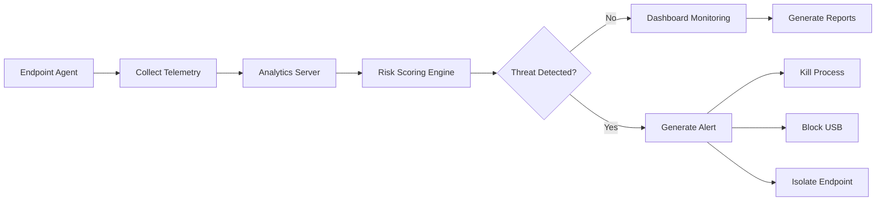

# 🛡️ SecureGuard Enterprise – Behavior-Based Endpoint Detection & User Behaviour Analytics (UBA) System for Insider Threat Identification

<p align="center">


\

</p>

---

# 📌 Overview

**SecureGuard Enterprise** is a Behavior-Based Endpoint Detection & Response (EDR) and User Behaviour Analytics (UBA) system designed to identify insider threats by continuously monitoring endpoint activities and analyzing user behavior.

The system collects real-time telemetry from Windows endpoints, including CPU usage, memory utilization, running processes, USB device activity, and sensitive file access. These events are transmitted to a centralized analytics server, where a dynamic risk-scoring engine evaluates user behavior and detects suspicious activities.

The project is designed for **final-year engineering projects**, **cybersecurity demonstrations**, **SOC (Security Operations Center) simulations**, and **hackathons such as Smart India Hackathon**.

---

# 🎯 Project Objectives

Modern organizations face increasing risks from insider threats that traditional antivirus software often fails to detect. SecureGuard Enterprise addresses this challenge by providing continuous endpoint monitoring and behavioral analytics.

The primary objectives are:

* Monitor endpoint activities in real time.
* Detect abnormal user behavior using dynamic risk scoring.
* Identify unauthorized USB devices and suspicious applications.
* Monitor access to sensitive files.
* Perform remote endpoint mitigation.
* Visualize enterprise security status through an interactive SOC dashboard.
* Export professional security reports.

---

# 🏗 System Architecture

```text
             Windows Employee Computer
        +--------------------------------+
        |        agent.py                |
        | CPU • RAM • USB • Processes    |
        | Sensitive File Monitoring      |
        +---------------+----------------+
                        |
               WebSocket Telemetry
                    Port : 5001
                        |
                        ▼
        +--------------------------------+
        |     Analytics Server           |
        |        server.py               |
        | Risk Analysis & Event Engine   |
        +---------------+----------------+
                        |
                  HTTP / WebSocket
                        |
                        ▼
        +--------------------------------+
        |   SOC Administration Dashboard |
        | Alerts • Reports • Controls    |
        +--------------------------------+
```

---

# ⚙ System Workflow



---

# 🚀 Features

* Real-time endpoint telemetry collection
* User Behaviour Analytics (UBA)
* Dynamic insider threat risk scoring
* USB device monitoring
* Sensitive file access detection
* Running process monitoring
* Remote process termination
* Endpoint isolation simulation
* Interactive SOC dashboard
* PDF, Excel, and CSV report generation
* Real-time WebSocket communication
* Pre-built attack simulation scenarios

---

# 📊 User Behaviour Analytics Engine

The analytics engine continuously evaluates endpoint events and assigns a dynamic risk score ranging from **0 to 100**.

### Risk Factors

* Login outside office hours
* Unauthorized USB devices
* Unknown executable files
* High CPU utilization
* Sensitive file access
* Unapproved software execution

Risk Levels

| Score    | Threat Level |
| -------- | ------------ |
| 0 – 30   | Low          |
| 31 – 60  | Medium       |
| 61 – 80  | High         |
| 81 – 100 | Critical     |

---

# 🛡 Detection Modules

## 🖥 Endpoint Telemetry

Collects:

* CPU Usage
* RAM Usage
* Running Processes
* USB Devices
* Disk Information
* Logged-in User

---

## 📂 Sensitive File Monitoring

Monitors all access to the protected **SensitiveData/** directory.

Activities detected include:

* File creation
* File modification
* File deletion
* Unauthorized access

---

## 🔌 USB Monitoring

Detects:

* USB insertion
* USB removal
* Unknown storage devices

Unauthorized USB devices immediately increase the user's risk score.

---

## ⚙ Process Monitoring

Tracks all running applications.

Flags:

* Blacklisted executables
* Unknown applications
* High CPU processes

---

# ⚡ Mitigation Controls

Administrators can execute several remote security actions directly from the SOC dashboard.

### Kill Process

Terminate suspicious applications running on the endpoint.

---

### Block USB

Disable unauthorized removable storage devices.

---

### Isolate Network

Disconnect the endpoint from network communication while displaying a full-screen security notification on the user's computer.

---

# 📊 SOC Dashboard

The Security Operations Center dashboard provides:

* Live Endpoint Status
* CPU Usage
* Memory Usage
* Connected Users
* Risk Scores
* Active Alerts
* USB Events
* Sensitive File Events
* Running Processes
* Endpoint Health
* Security Timeline
* Administrative Controls

---

# 📂 Repository Structure

```text
secureguard-enterprise/

├── public/
│   ├── css/
│   │   └── styles.css
│   ├── js/
│   │   ├── app.js
│   │   └── reports.js
│   └── index.html
├── SensitiveData/
├── agent.py
├── server.py
├── database.json
├── requirements.txt
└── README.md
```

---

# 🚀 Installation & Setup Guide

## 1. Install Dependencies

```bash
pip install flask websockets psutil
```

---

## 2. Start the Analytics Server

```bash
python server.py
```

Dashboard URL:

```text
http://localhost:5000
```

WebSocket Server:

```text
ws://localhost:5001
```

---

## 3. Start the Endpoint Agent

```bash
python agent.py --username Kumar
```

The endpoint immediately appears as **Online** in the SOC Dashboard.

---

# 🧪 Demonstration Scenarios

## Scenario 1 – Normal User

* Low CPU utilization
* No USB devices
* Trusted applications
* No sensitive file access

Risk Score:

```text
12 / 100
(Low)
```

---

## Scenario 2 – Insider Threat

Simulated activities include:

* Login outside office hours
* Unauthorized USB insertion
* Malware execution
* High CPU utilization
* Sensitive file access

Risk Score:

```text
100 / 100
(Critical)
```

The dashboard immediately displays Critical Alerts.

---

# 📄 Security Reports

The reporting module supports exporting:

### PDF Report

Includes:

* Executive Summary
* Risk Analysis
* Threat Timeline
* Endpoint Statistics

---

### Excel Report

Exports multiple worksheets containing:

* Endpoint Inventory
* User Activities
* Risk Scores
* Security Events

---

### CSV Export

Downloads raw behavioral audit logs for further analysis.

---

# 📈 Performance

| Metric                   | Value             |
| ------------------------ | ----------------- |
| Endpoint Monitoring      | Real-Time         |
| Communication            | WebSocket         |
| Risk Analysis            | Dynamic           |
| Insider Threat Detection | Yes               |
| Dashboard                | Live              |
| Report Export            | PDF / Excel / CSV |

---

# 💡 Future Enhancements

* Machine Learning Risk Prediction
* Active Directory Integration
* SIEM Integration
* Email Alert Notifications
* Multi-Agent Deployment
* Linux Endpoint Support
* Threat Intelligence Feeds
* Ransomware Detection
* Cloud-Based Analytics
* Mobile Monitoring Dashboard

---

# 📷 Screenshots

Store project screenshots inside:

```text
screenshots/
```

Example:

```text
screenshots/dashboard.png
screenshots/alerts.png
screenshots/risk-analysis.png
screenshots/reports.png
```

Display them using standard Markdown image tags.

---

# 📚 Conclusion

SecureGuard Enterprise demonstrates how modern organizations can detect insider threats using behavior-based analytics instead of relying solely on signature-based antivirus solutions.

By combining **endpoint telemetry**, **real-time risk scoring**, **remote mitigation controls**, **interactive SOC dashboards**, and **executive reporting**, the system provides a practical simulation of an enterprise Endpoint Detection and Response (EDR) platform suitable for cybersecurity education, research, and demonstrations.

---

# 👨‍💻 Author

**shafaat**

**Computer and Communication Engineering**

Cyber Security • Endpoint Security • Python • Flask • WebSockets

---

# 📄 License

This project is licensed under the **MIT License**.

---

# ⭐ Support

If you found this project useful:

⭐ Star this repository

🍴 Fork this repository

🐞 Report Issues

🚀 Contribute to improve the project
